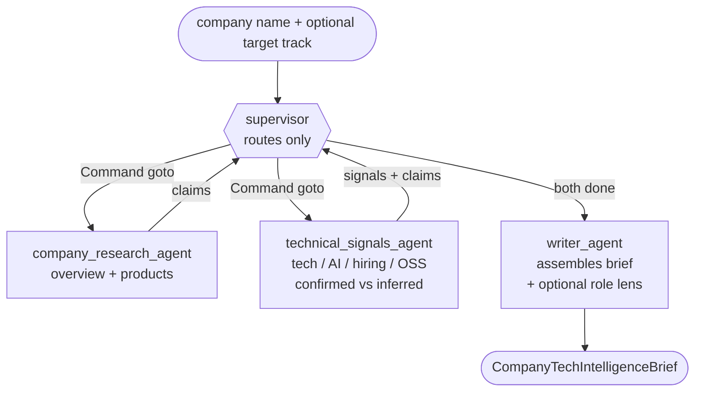

# DiligenceDesk

**A LangGraph multi-agent company technical-intelligence assistant for technical
due diligence and optional interview preparation.**

Given a company name, DiligenceDesk gathers **general company technical
intelligence first**: products & services, a company overview, tech-stack signals,
AI/data/automation signals, hiring tracks, engineering & open-source signals,
evidence quality, and a source for every factual claim. If you also pass a
`--target-track`, the brief adds an **optional** role-specific
interview-preparation lens — a bonus layer, not the core product.

```bash
python run.py --mode stub --company "Acme AI Health"                       # general tech intelligence
python run.py --mode stub --company "Acme AI Health" --target-track ai_engineer   # + interview-prep lens
```

> This is a **factual technical summary of public information**, not advice. Every
> factual claim is grounded in a source. Tech detection is noisy, so every
> technical signal is labelled **confirmed | inferred | not_found**, where the
> level is **derived from the source's domain** — a signal on the company's own
> site is `confirmed`; a job board / news / third-party mention is `inferred`, and
> is **never** upgraded to confirmed. The role lens is **interpretation** based on
> collected signals, not a directly sourced fact.

Retrieval is **deep and Egypt-scoped by default**: it resolves the company's
official domain, runs targeted site-scoped queries, and aggregates job postings
across **Glassdoor, LinkedIn (search-result only), Wuzzuf, and Bayt** via a
`find_jobs` tool (`--location`, default `egypt`). Every run records retrieval
counters (pages fetched, sources by type, jobs per board) for transparency.

**Two ways it's useful:** as **technical due diligence** (a company's public tech
stack, AI/data maturity, hiring direction, and engineering evidence — the
Advisory/Applied-AI angle), and as **interview prep** for a technical job seeker
(the optional role lens).

---

## The four pillars (and where each lives)

| Pillar | What it means here | Where |
| --- | --- | --- |
| **Multi-agent orchestration** | A LangGraph **supervisor** routes to exactly 4 agents with `Command(goto=...)`. | [supervisor.py](src/diligencedesk/supervisor.py), [graph.py](src/diligencedesk/graph.py), [agents.py](src/diligencedesk/agents.py) |
| **MCP with local fallback** | One tool interface, three modes — `stub`/`local`/`mcp` — behind `get_tools(mode)`. MCP is the tool-access **layer**, not the product. | [tools/provider.py](src/diligencedesk/tools/provider.py) |
| **Evaluation & observability** | An **offline** eval: routing, groundedness, tech/AI/hiring recall, **uncertainty honesty**, **role-lens completeness**, validity. LangSmith optional. | [eval/evaluate.py](eval/evaluate.py), [eval/scenarios.json](eval/scenarios.json) |
| **SLMs (per-role models)** | The supervisor runs on a **stronger** model; the specialists on a small/cheap **SLM**. Pure config. | [config.py](src/diligencedesk/config.py), [llm.py](src/diligencedesk/llm.py) |

## The team (exactly 4 agents in V1)



V1 stays at **4 agents on purpose**. AI signals, hiring tracks, uncertainty, and
the role lens are NOT separate agents — they live inside `technical_signals_agent`
and `writer_agent`. The specialists never write the brief: they contribute typed,
**source-cited** evidence (`Claim` / `TechnicalSignal` / `HiringTrackSignal`) and
the writer assembles the brief from that evidence alone.

---

## Quick start

```bash
pip install -r requirements.txt          # core block is enough for stub mode
cp .env.example .env                      # only needed if you leave stub mode
```

### 1) `stub` — keyless, fully offline, deterministic (start here)

A deterministic stub LLM + canned tools drive the full flow over four synthetic
companies chosen to exercise every path:

```bash
python run.py --mode stub --company "Acme AI Health"          # AI/data-heavy
python run.py --mode stub --company "Globex Cloud Systems"    # backend/cloud, no AI
python run.py --mode stub --company "Initech ERP Services"    # Odoo/SAP/ERP
python run.py --mode stub --company "NoSignal Consulting"     # limited info -> honest gaps
python run.py --mode stub --company "Acme AI Health" --target-track ai_engineer
python run.py --list-companies
```

### 2) `local` — real public data, zero MCP setup (just an LLM key)

Real `web_search`, `fetch_page` (httpx), Egypt-scoped `find_jobs`, and a local
`save_brief`. The LinkedIn **page** is never fetched (login wall) — only its search
snippet.

**Pluggable search providers** (via `SEARCH_PROVIDER`): `ddgs` (default, free,
keyless — but weak/rate-limited), `tavily`, `brave`, or `serpapi` (each needs its
API key). Any provider error / missing key falls back to `ddgs`, and each applies
the Egypt locale (`gl=eg` / `country=EG` / `country=egypt`). Richer providers give
deeper results and populated hiring tracks:

```bash
python run.py --mode local --provider groq --company "PwC ETIC" --location egypt --target-track ai_engineer --save
SEARCH_PROVIDER=tavily python run.py --mode local --provider groq --company "PwC ETIC" --location egypt --target-track ai_engineer --save
```

### 3) `mcp` — the MCP learning path (needs uv + Node)

`fetch` + `filesystem` come from **real MCP servers** over stdio; search stays
local for now (`# V1.5:` migrate search/GitHub/careers to MCP). If the servers
can't start, the tool layer **falls back to local** rather than crashing.

```bash
python run.py --mode mcp --provider groq --company "Airbnb"
```

---

## Example (the honest evidence levels)

`python run.py --mode stub --company "Acme AI Health"` →

```markdown
## Technical signals
- **[confirmed]** Python (language)  (https://acme-ai-health.com/engineering)     # official domain
- **[confirmed]** FastAPI (framework)  (https://acme-ai-health.com/engineering)
- **[inferred]** Kubernetes (devops)  (https://www.wsj.com/articles/acme-ai-...)  # third-party -> inferred

## Hiring tracks
- AI Engineer (via job_posting)  (https://www.glassdoor.com/job-listing/mle-acme-egypt)
- Data Engineer (via job_posting)  (https://www.linkedin.com/jobs/view/acme-...)

## Retrieval
- Official domain: acme-ai-health.com
- Job location scope: egypt
- Pages fetched: 4
- Sources by type: {'official': 12, 'third_party': 6}
- Jobs per source: {'glassdoor': 1, 'linkedin': 1, 'wuzzuf': 1, 'bayt': 1}
```

Kubernetes here is mentioned only in a third-party (WSJ) article, so it stays
**inferred** — the evidence level is derived from the source's domain and is never
upgraded. Hiring tracks come from real Egypt job postings (non-technical titles
like "HR Manager" are excluded). For *Globex Cloud Systems* (no public AI) the
brief instead lists *"No AI or data signals were found ... (egypt-scoped search)."*

## Evaluation

```bash
python eval/evaluate.py
```

Runs the real graph in stub mode over [eval/scenarios.json](eval/scenarios.json)
and prints a metrics table:

```
METRIC                          VALUE
  routing_correctness           100%
  groundedness                  100%
  tech_signal_recall            100%
  ai_data_signal_recall         100%
  hiring_track_detection        100%
  uncertainty_honesty           100%
  products_extracted            100%
  role_lens_completeness        100%
  report_validity               100%
```

`groundedness` enforces the domain rule: **every `confirmed` signal's source host
must equal the company's official domain**, and a known third-party tech must stay
`inferred` (a fixture with a WSJ mention locks this in). `uncertainty_honesty`
checks the system says so when a signal is absent (Egypt-scoped) and never claims a
gap that isn't there; `products_extracted` checks the products page was mined;
`role_lens_completeness` checks the lens is null without a track and populated with
one. (LangSmith optional; the eval is fully offline.)

## Tests

```bash
python -m pytest          # 35 passed, 1 skipped — no key, no network, no uvx
```

The one skipped test exercises the real MCP servers; set `RUN_MCP_TESTS=1` (with
uv + Node) to run it.

---

## MCP security & Responsible-AI notes

**MCP security posture** (V1): trusted reference servers only; **read-only**; the
filesystem server is **scoped to a single directory** (`outputs/`); short
timeouts; no arbitrary shell; tool calls are auditable in the streamed trace. MCP
is the tool-access layer, not the product.

**Responsible AI**: read-only research over **public** information; the brief is a
**factual technical summary, not advice**; every factual claim is grounded in a
source; tech detection only surfaces technologies that literally appear in the
gathered text (it can't invent one); evidence levels keep **inferred** from being
read as **confirmed**; uncertainties are stated honestly; the role lens is clearly
marked as interpretation, not a sourced company claim; `needs_human_review` is set
when coverage is thin.

## Roadmap

- **V1.5** (`# V1.5:` seams in code): FastAPI `POST /company-tech-brief`; Docker;
  GitHub/search MCP servers; a dedicated careers/job-page tool; role-profile YAMLs
  (`profiles/ai_engineer.yaml`, `backend_engineer.yaml`, `data_engineer.yaml`,
  `odoo_functional.yaml`, `sap_consultant.yaml`).
- **Phase 2** (`# PHASE 2:` markers): a custom MCP server with FastMCP; a CrewAI
  variant; an AutoGen comparison; human-in-the-loop before saving/publishing;
  competitor comparison; an ESG / compliance / technical-risk agent.

## License

MIT.
